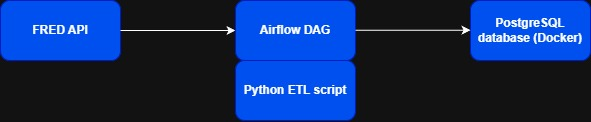
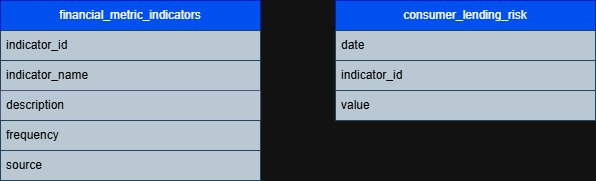

# **Consumer Lending Risk Project**

## **Project Overview**

This project builds a data pipeline that ingests macroeconomic indicators related to consumer lending risk using the FRED API from the Federal Reserve Bank of St. Louis.

The pipeline collects economic indicators such as unemployment, inflation, mortgage rates, and consumer credit levels from 01/01/1991 until current day and loads them into a PostgreSQL data warehouse for analysis.

## **Architecture Diagram**

## **Data Sources**

Economic indicators used:
*     CPIAUCSL - Consumer Price Index for All Urban Consumers: All Items in U.S. City Average 
*     UNRATE - Unemployment Rate
*     DRCCLACBS - Delinquency Rate on Credit Card Loans, All Commercial Banks
*     MORTAGE30US - 30-Year Fixed Rate Mortgage Average in the United States 
*     TOTALSL  - Total Consumer Credit Owned and Securitized
*     TDSP  - Household Debt Service Payments as a Percent of Disposable Personal Income

## **Data Model**

## **Pipeline Workflow**

1. API key is retrieved from config file
2. Python script calls FRED API for each indicator
3. The JSON response from FRED API is parsed and cleaned
4. The parsed JSON is then arranged into a standardized schema
5. Data is loaded to PostgreSQL tables and is available for analysis

## **Technologies Used**
- Python
- PostgreSQL
- FRED API
- SQL
- Git

## **Data Pipeline Use Cases**
- Analyze how rising unemployment correlates with increased credit card delinquency rates.
- Investigate whether consumer borrowing increases during inflationary periods.
- Evaluate how mortgage rate changes impact overall credit expansion.